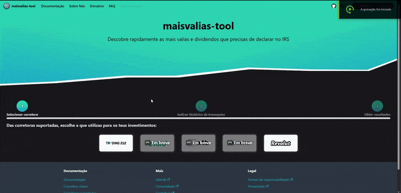

<p align="center">
    
    <h1 style="margin-top:-15px" align="center">maisvalias-tool</h1>
</p>

[](https://github.com/Tomas-Silva-PT/maisvalias-tool/actions/workflows/deploy.yml) [](https://github.com/Tomas-Silva-PT/maisvalias-tool/actions/workflows/tests.yml)  [](https://github.com/Tomas-Silva-PT/maisvalias-tool/blob/main/LICENSE)  [](https://tomas-silva-pt.github.io/maisvalias-tool/docs/intro)    [](https://github.com/Tomas-Silva-PT/maisvalias-tool/stargazers)

## Introdução

A ferramenta **maisvalias-tool** tem como objetivo auxiliar investidores na organização de informações relativas a mais-valias e dividendos, com vista à preparação da declaração de IRS em Portugal.

Para quem utiliza corretoras para efetuar os seus investimentos poderá utilizar esta ferramenta para transformar o histórico de compras e vendas no formato requerido pela _Autoridade Tributária e Aduaneira (AT)_ no momento de preenchimento da declaração anual de rendimentos.

[](./assets/maisvalias-tool-demo.gif)

## Documentação

Se estiveres interessado e quiseres saberes mais informações acerca desta ferramenta, está tudo documentado [aqui](https://tomas-silva-pt.github.io/maisvalias-tool/docs/intro).

## Utilização

### Online (recomendado)

Para utilizares esta ferramenta, dirige-te à [página oficial](https://Tomas-Silva-PT.github.io/maisvalias-tool).

### Localmente

Se quiseres utilizar esta ferramenta no teu ambiente local, segue os seguintes passos:

#### 1. Clonar o repositório

```bash
git clone https://github.com/Tomas-Silva-PT/maisvalias-tool.git
```

#### 2. Instalar as dependências da ferramenta

```bash
cd maisvalias-tool/src
npm install
npm run build
```

#### 3. Instalar as dependências do website

```bash
cd maisvalias-tool/website
npm install
```

#### 4. Iniciar o website

```bash
npm run start
```

Para aprenderes a utilizar a ferramenta, consulta a [documentação](https://tomas-silva-pt.github.io/maisvalias-tool/docs/intro) no site oficial.

## Contribuição

Se quiseres contribuir para o projeto, dá uma olhadela ao [guia de contribuição](./CONTRIBUTING.md).

## Privacidade

A **maisvalias-tool** foi desenvolvida com foco na **privacidade** dos utilizadores.

Antes de utilizares a ferramenta, consulta as políticas de privacidade [aqui](PRIVACY.md).

## Termos de responsabilidade

Antes de utilizares a ferramenta, consulta os termos de responsabilidade [aqui](DISCLAIMER.md).

## Licença

**Maisvalias-tool** é disponibilizado sob a licença [MIT License](./LICENSE).
