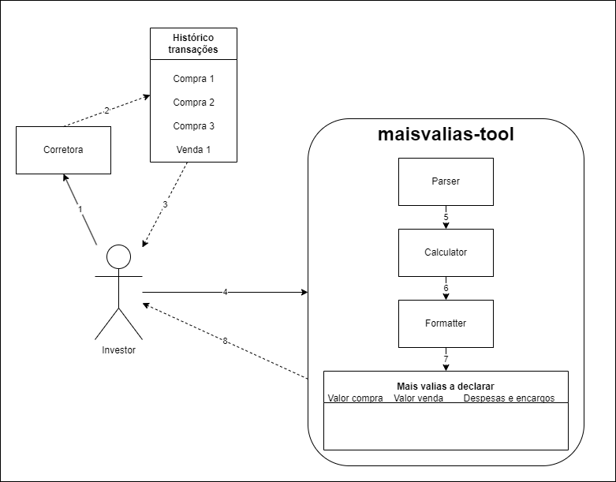

# Arquitetura

Descobre como está montada a **maisvalias-tool**. 🏗️

## Arquitetura do software

Na verdade a ferramenta até é relativamente simples, e pode ser resumida ao seguinte esquema:

---

## Obter o histórico de transações  

Antes de utilizar a **maisvalias-tool**, o investidor deve extrair da sua corretora o seu histórico de transações.  
Esta extração está representada pelos passos **1, 2 e 3**.  

---

## Parser  

Quando o utilizador tiver o histórico de transações disponível, enviá-lo-á para a **maisvalias-tool**, representado pelo passo **4**.  

1. A ferramenta extrai os dados necessários do histórico, normalmente num ficheiro **.csv**.
2. O **parser** analisa e padroniza os dados para que possam ser utilizados na próxima etapa.
3. O resultado desta fase é um **extrato padronizado**, contendo todas as informações essenciais para o próximo passo.

---

## Calculator  

Com os dados extraídos e padronizados pelo **parser**, entra em ação o **calculator** no passo **5**:  

- Realiza os cálculos necessários para determinar as **mais-valias**.

---

## Formatter  

Com os calculados feitos pelo **calculator**, entra em ação o **formatter** no passo **6**:  

- Formata os dados conforme o exigido pela **Autoridade Tributária e Aduaneira (AT)**.   
- Gera uma **tabela estruturada**, pronta para revisão e utilização.  

O resultado final será entregue ao investidor no passo **7** e **8**, permitindo-lhe confirmar os dados e utilizá-los conforme necessário.

---

Para mais detalhes sobre este processo, consulta a secção **"Algoritmo"**.  

## Tecnologias utilizadas

### Linguagem  
Atualmente desenvolvida em **Typescript**, o _core_ da ferramenta assenta nesta linguagem para transformação do teu histórico de transações no formato desejado para declaração no IRS.  

### Bibliotecas/APIs Utilizadas  
- **Yahoo Finance API** – usada para obter dados financeiros das ações em que investes.
- **Banco de Portugal** - usada para obter dados sobre taxas de câmbio.