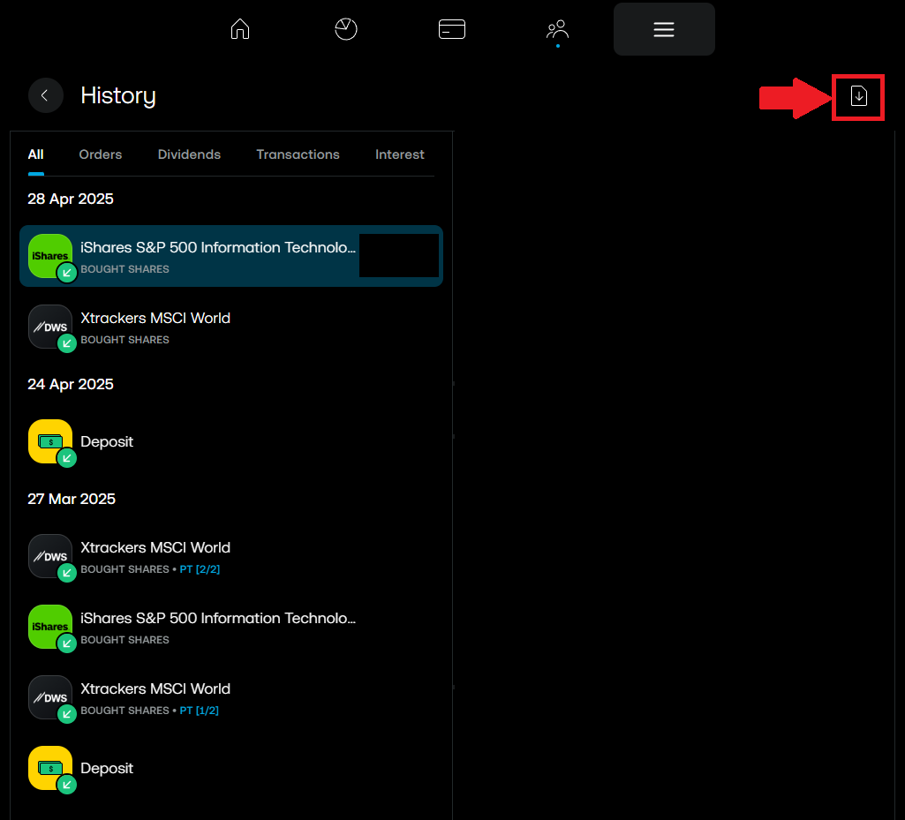
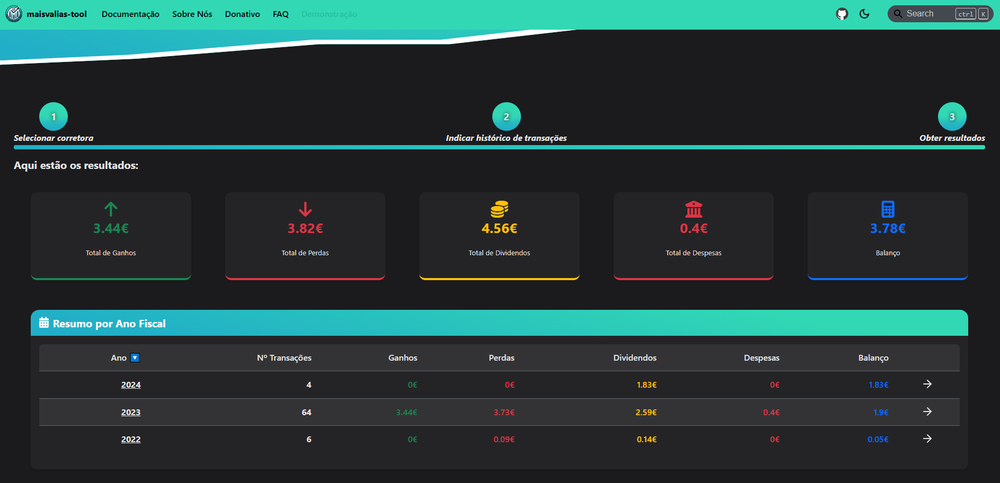

# Trading 212

Descobre como utilizar a ferramenta com esta corretora.

Para utilizares a ferramenta `maisvalias-tool` com esta corretora, precisas de obter o histórico das transações efetuadas **desde do ano em que realizaste a primeira compra de um ativo**.

O seguinte guia vai ensinar-te, passo a passo, como calcular automaticamente as tuas mais valias obtidas através da Trading 212.

## Como obter ficheiro do histórico de transações

### Passo 1: Aceder ao menu

### Passo 2: Consultar histórico

### Passo 3: Selecionar opção para exportar histórico

### Passo 4: Selecionar intervalo de datas para o histórico de transações

:::info

A Trading 212 limita o intervalo de datas, **permitindo apenas exportar 1 ano de cada vez**.

Assim, se utilizas a Trading 212 desde 2022, **precisarás exportar o histórico ano a ano**, de 2022 até ao ano atual.
:::

### Passo 5: Exportar histórico

### Passo 6: Repetir passos anteriores, para cada ano

Repete os passos anteriores para cada ano em que tens conta na Trading 212.

Se, por exemplo, tiveres criado conta em 2022, exporta o histórico de 2022, 2023, 2024, ..., até ao ano atual.

Agora que tens todos os ficheiros necessários, vamos ver como utilizá-los no `maisvalias-tool`.

## Como utilizar maisvalias-tool

No site oficial, navega até à página `Demonstração`:

De seguida, seleciona a `Trading 212`:

Nos ficheiros, coloca **todos os ficheiros que exportaste na [fase anterior](#como-obter-ficheiro-do-histórico-de-transações)**:

___

:::info

Os nomes dos ficheiros exportados foram alterados para serem mais fáceis de identificar, na verdade a Trading212 atribui nomes muito mais... _complicados_.

De qualquer modo o nome dos ficheiros não é relevante, mas sim o seu conteúdo!

:::

Com os ficheiros carregados, basta dares início ao processo de cálculo:

___

___

:::success

_Et voilá_! Deverás ter discriminado por ano fiscal tanto as mais valias como os dividendos que tens de declarar no IRS.

:::