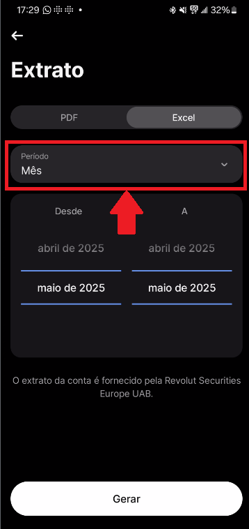
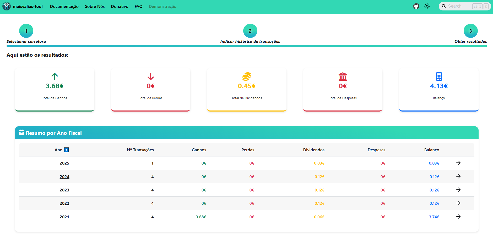

# Revolut

Descobre como utilizar a ferramenta com esta corretora

Para utilizares a ferramenta `maisvalias-tool` com esta corretora, precisas de obter o histórico das transações efetuadas **desde do ano em que realizaste a primeira compra de um ativo**.

O seguinte guia vai ensinar-te, passo a passo, como calcular automaticamente as tuas mais valias obtidas através da Revolut.

## Como obter os ficheiros necessários

### Passo 1: Aceder à conta de investimento

### Passo 2: Consultar documentos

### Passo 3: Escolher a conta na corretora

### Passo 4: Obter o extrato da conta

### Passo 5: Obter extrato de lucros e perdas

E assim tens os ficheiros necessários para utilizar a ferramenta `maisvalias-tool`.

## Como utilizar maisvalias-tool

No site oficial, navega até à página `Demonstração`:

De seguida, seleciona a `Revolut`:

Carrega na aplicação **todos os ficheiros que exportaste na [fase anterior](#como-obter-os-ficheiros-necessários)**:

### Carregar ficheiro do histórico das operações

___

___

### Carregar ficheiro do extrato de lucros e perdas

___

___

:::info

Os nomes dos ficheiros exportados foram alterados para serem mais fáceis de identificar.

O nome dos ficheiros não é relevante, mas sim o seu conteúdo!

:::

Com os ficheiros carregados, basta dares início ao processo de cálculo:

___

___

:::success

_Et voilá_! Deverás ter discriminado por ano fiscal tanto as mais valias como os dividendos que tens de declarar no IRS.

:::