# Degiro

Descobre como utilizar a ferramenta com esta corretora.

Para utilizares a ferramenta `maisvalias-tool` com esta corretora, precisas de obter o histórico das transações efetuadas **desde do ano em que realizaste a primeira compra de um ativo**.

O seguinte guia vai ensinar-te, passo a passo, como calcular automaticamente as tuas mais valias obtidas através da Degiro.

## Como obter: histórico de transações

### Passo 1: Aceder à tua _Inbox_

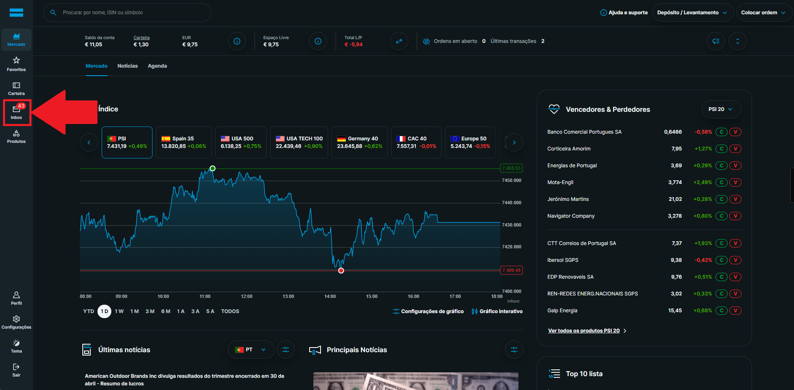

### Passo 2: Aceder à aba _Transações_

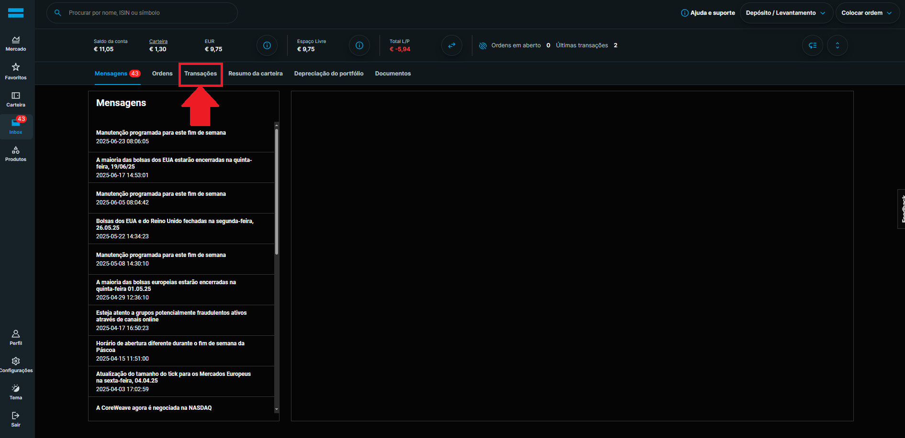

### Passo 3: Preencher intervalo de datas

:::info

Preenche o intervalo de datas de modo obtenhas os dados desde que **criaste conta na Degiro**. Será preciso todas as transações para que a fórmula de cálculo (FIFO) funcione corretamente:

:::

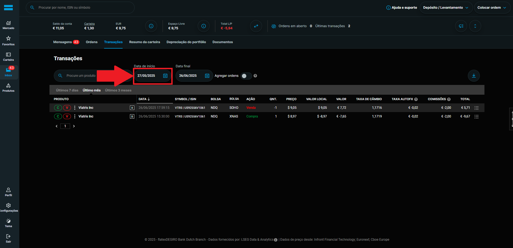

### Passo 4: Exportar os dados

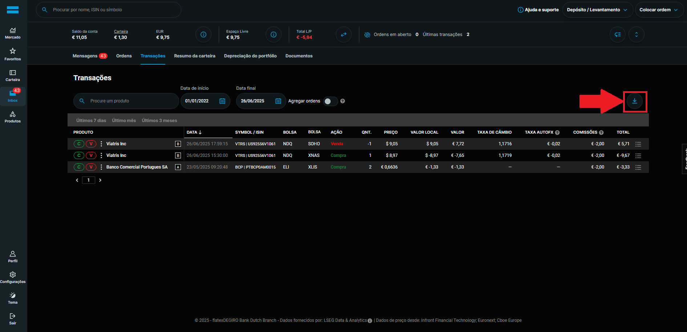
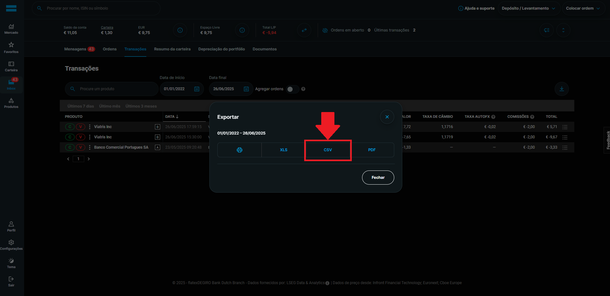

:::info

Escolhe o formato `csv` para ser compatível com a **maisvalias-tool**.

:::

Assim vais obter o histórico de transações necessário para utilizar a ferramenta. 

Agora resta obter o resumo da conta.

## Como obter: resumo da conta

### Passo 1: Aceder à aba _Resumo da carteira_

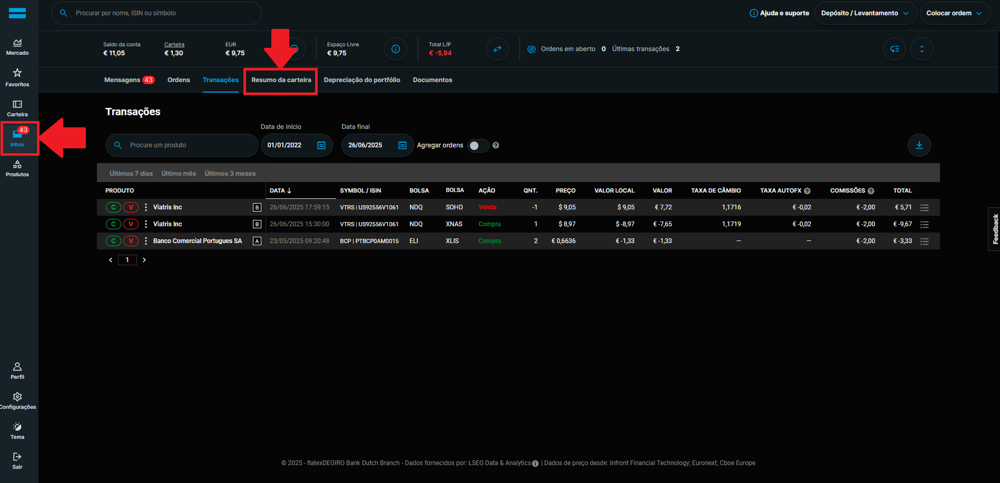

### Passo 2: Preencher intervalo de datas

:::info

Preenche o intervalo de datas de modo obtenhas os dados desde que **criaste conta na Degiro**. Será preciso todas as transações para que a fórmula de cálculo (FIFO) funcione corretamente:

Garante também que tens todas as divisas selecionadas, para que sejam descritos todos os dividendos que recebeste, independentemente da moeda (ex.: EUR, USD, CHF...).

:::

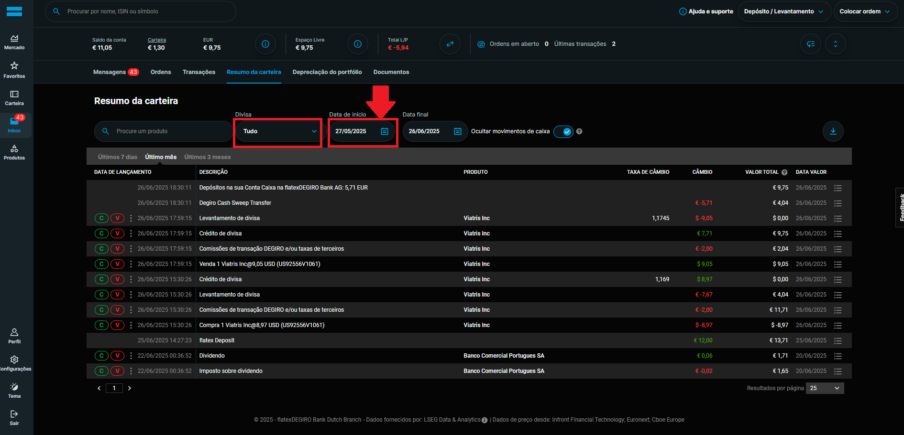

### Passo 3: Exportar os dados

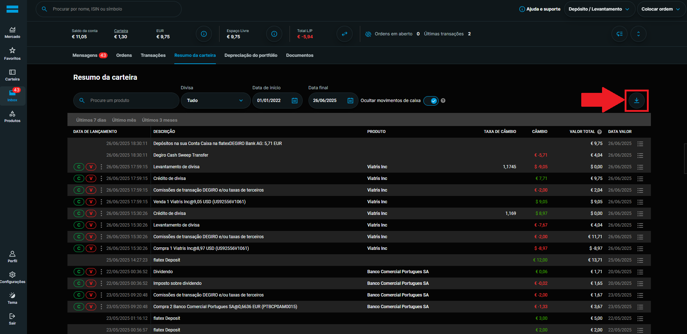
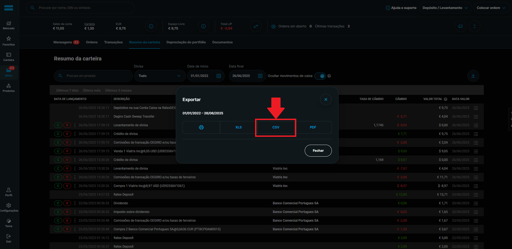

:::info

Escolhe o formato `csv` para ser compatível com a **maisvalias-tool**.

:::

E assim tens os ficheiros necessários para utilizar a ferramenta `maisvalias-tool`.

## Como utilizar maisvalias-tool

No site oficial, navega até à página `Demonstração`:

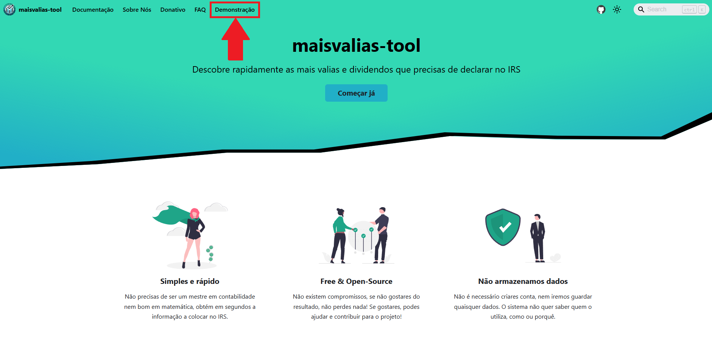

De seguida, seleciona a `Degiro`:

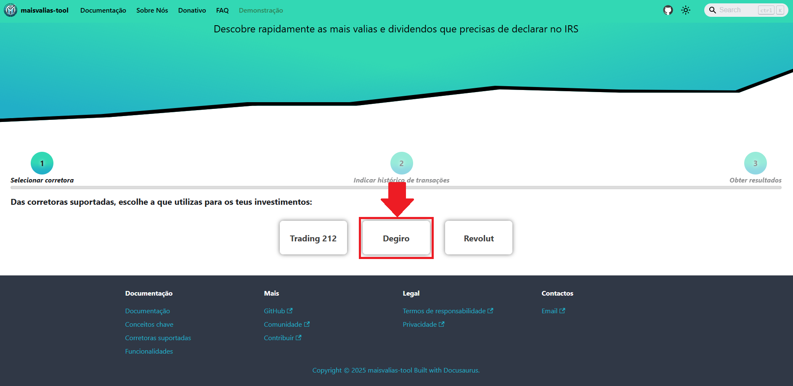

Carrega na aplicação **todos os ficheiros que exportaste na [fase anterior](#como-obter-histórico-de-transações)**:

### Carregar ficheiro do histórico das transações

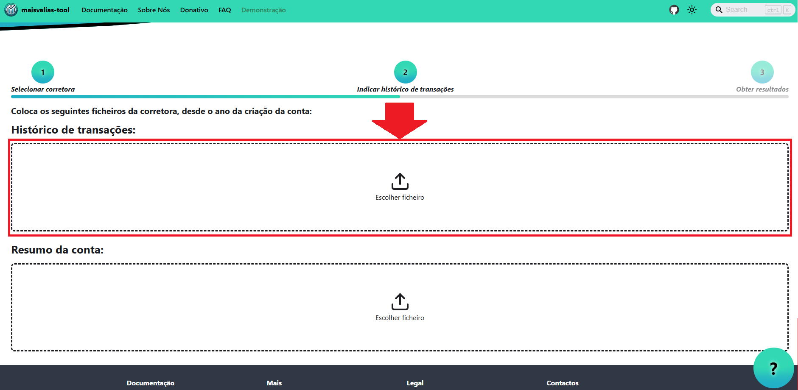
___
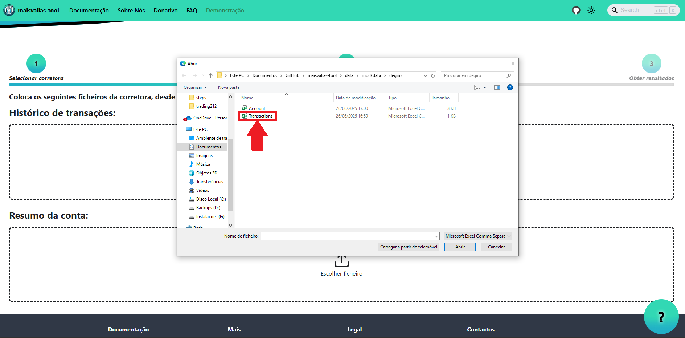
___

### Carregar ficheiro do resumo da carteira

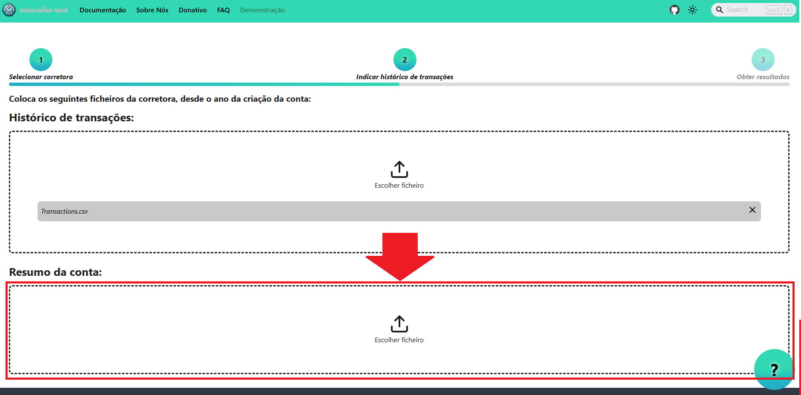
___
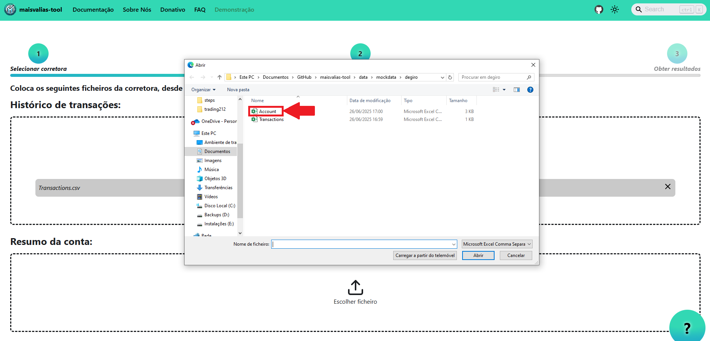
___

:::info

Os nomes dos ficheiros exportados foram alterados para serem mais fáceis de identificar.

O nome dos ficheiros não é relevante, mas sim o seu conteúdo!

:::

Com os ficheiros carregados, basta dares início ao processo de cálculo:

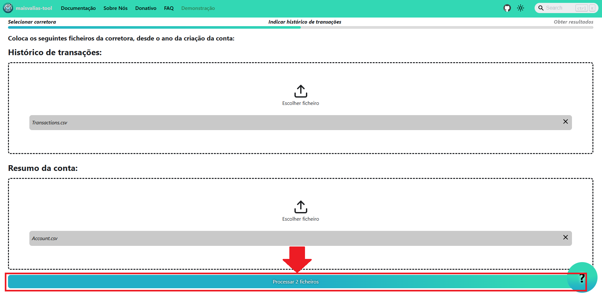
___
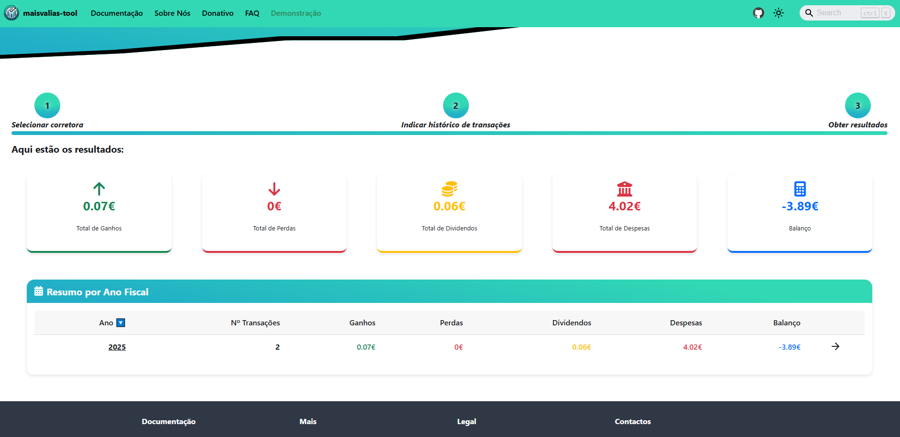

:::success

_Et voilá_! Deverás ter discriminado por ano fiscal tanto as mais valias como os dividendos que tens de declarar no IRS.

:::