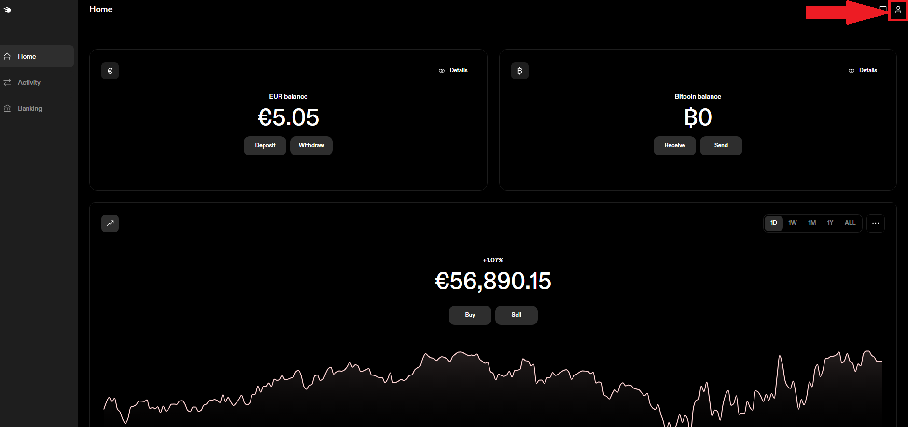
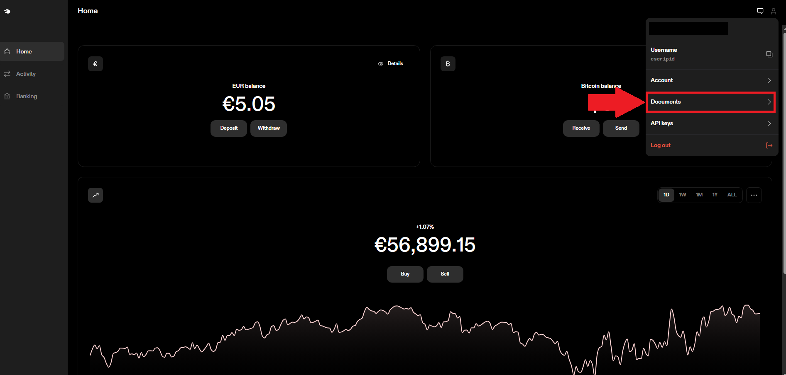
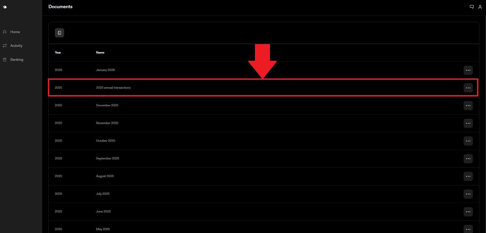
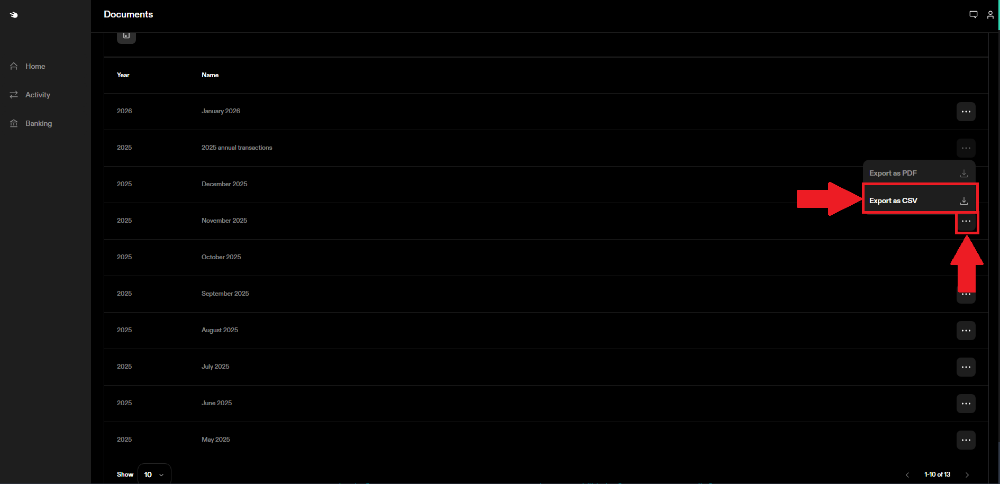
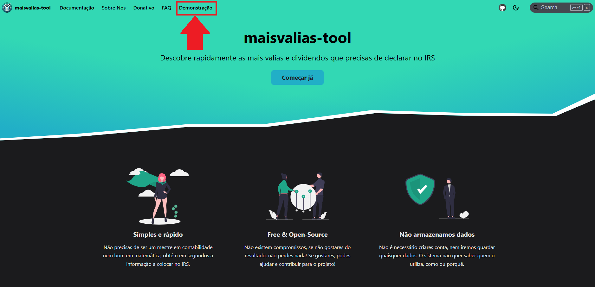
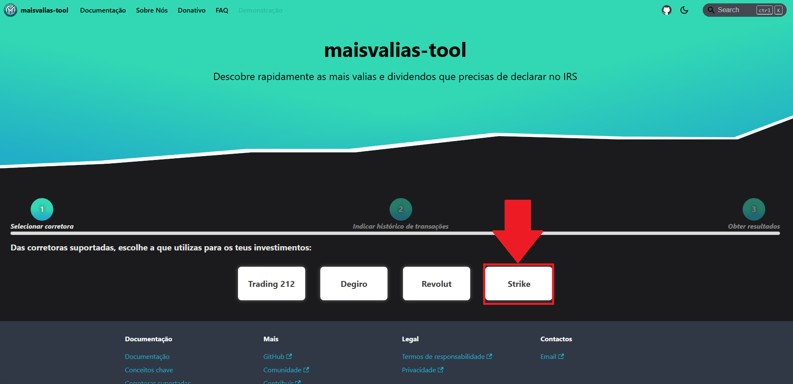
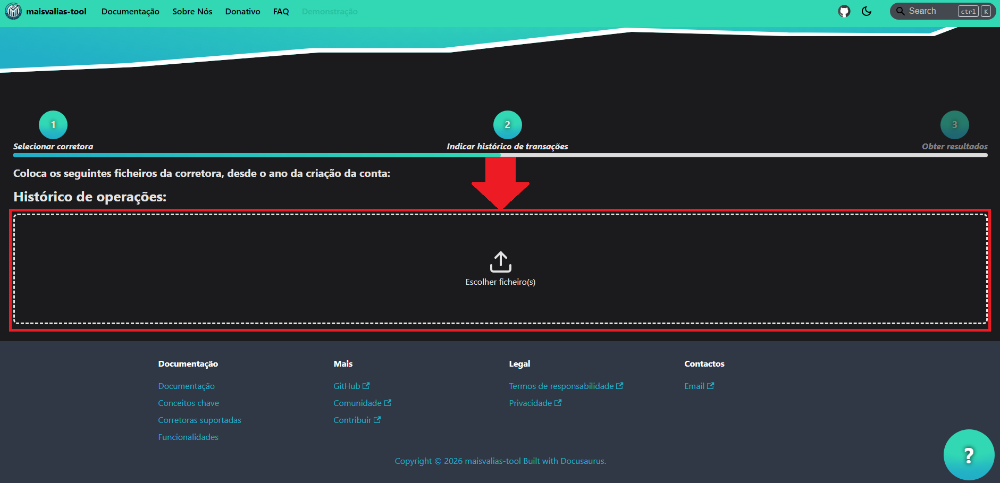
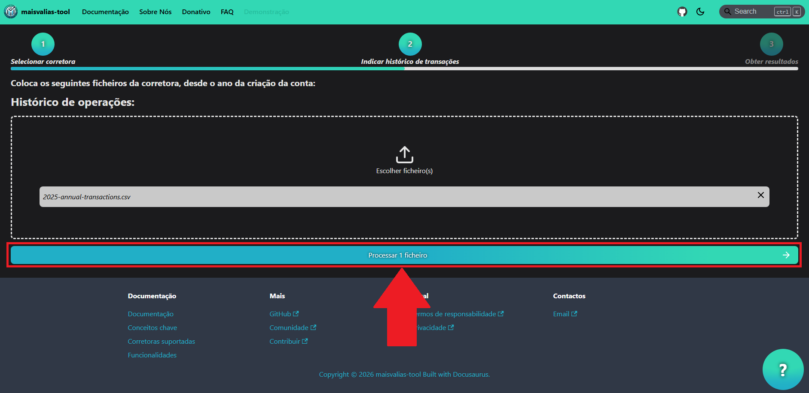
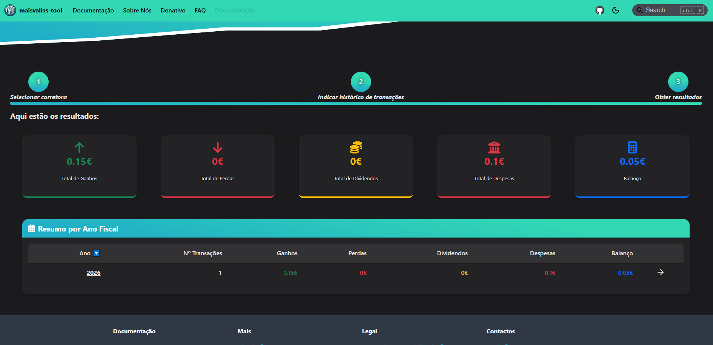

# Strike

Descobre como utilizar a ferramenta com esta corretora.

Para utilizares a ferramenta `maisvalias-tool` com esta corretora, precisas de obter o histórico das transações efetuadas **desde da data em que realizaste a primeira compra de bitcoin**.

:::warning

Devido à natureza atual das criptomoedas, a ferramenta irá calcular corretamente as mais-valias **apenas se as transações de compra e venda tiverem sido feitas na Strike**.

Isto significa que a ferramenta assume a Bitcoin que vendeste na Strike também lá foi comprada.

Se compraste Bitcoin noutra plataforma (ex: Binance, Coinbase, Kraken, etc...) e depois movimentaste para a Strike para a vender, **a ferramenta não te poderá ajudar a calcular as mais-valias**.

:::

O seguinte guia vai ensinar-te, passo a passo, como calcular automaticamente as tuas mais valias obtidas através da Strike.

## Como obter: histórico de transações

### Passo 1: Aceder às definições

### Passo 2: Aceder à aba _Documents_

### Passo 3: Identificar os extratos necessários

:::info

Para o correto cálculo das mais-valias, é necessário que faças o download dos extratos anuais de **todos os anos desde que começaste a utilizar a Strike** para compra e venda de Bitcoin. 

Será preciso todas as transações para que a fórmula de cálculo _FIFO_ funcione corretamente.

:::

Neste exemplo foi identificado o extrato de 2025 pois foi o ano em que começei a utilizar a Strike.

### Passo 4: Fazer download dos extratos identificados

:::info

Escolhe o formato `csv` para ser compatível com a **maisvalias-tool**.

:::

Quando terminares o download de todos os extratos anuais necessários tens os ficheiros necessários para utilizar a ferramenta `maisvalias-tool`.

## Como utilizar maisvalias-tool

No site oficial, navega até à página `Demonstração`:

De seguida, seleciona a `Strike`:

Carrega na aplicação **todos os ficheiros que exportaste na [fase anterior](#como-obter-histórico-de-transações)**:

### Carregar ficheiro do histórico das transações

___

:::info

Os nomes dos ficheiros exportados foram alterados para serem mais fáceis de identificar.

O nome dos ficheiros não é relevante, mas sim o seu conteúdo!

:::

___

### Processar os ficheiros

Com os ficheiros carregados, basta dares início ao processo de cálculo:

### Obter os resultados

:::success

_Et voilá_! Deverás ter discriminado por ano fiscal as mais valias que tens de declarar no IRS.

:::