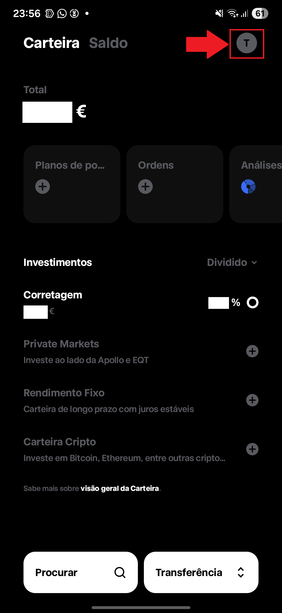
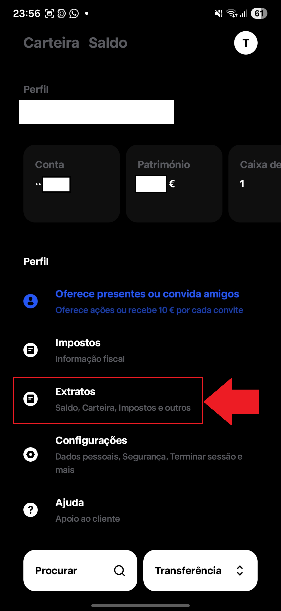
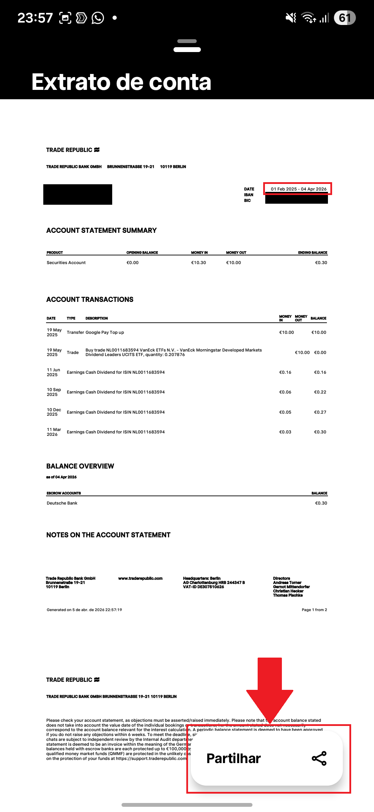
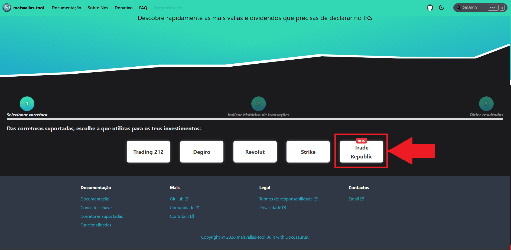
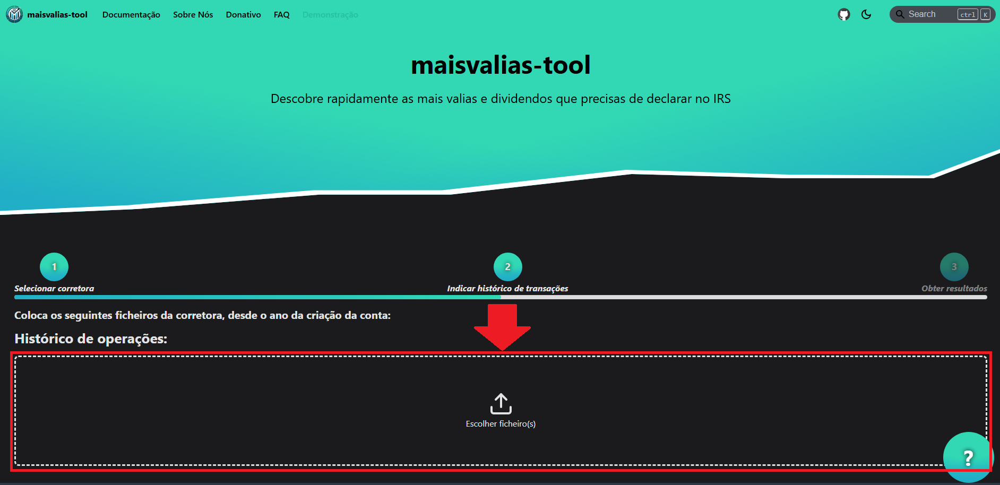
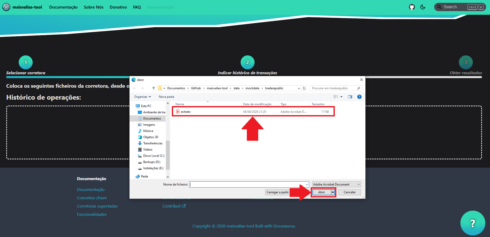
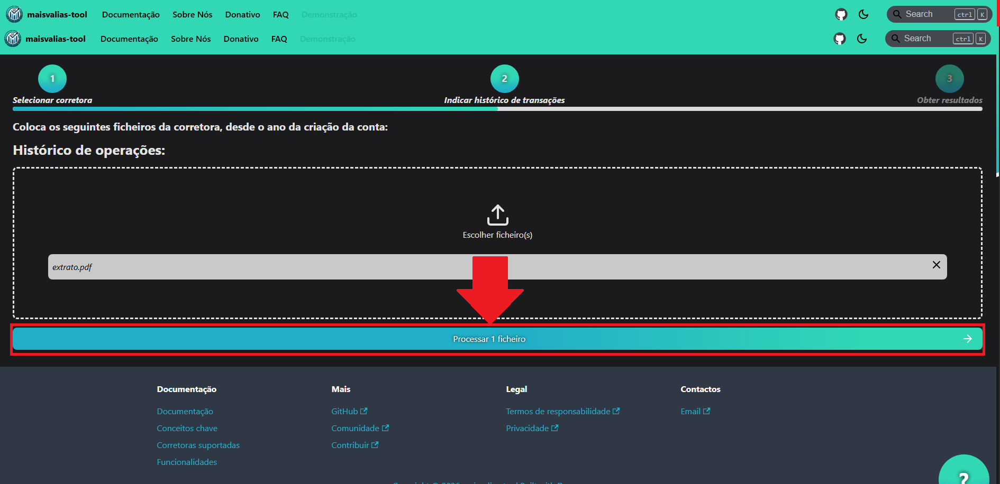
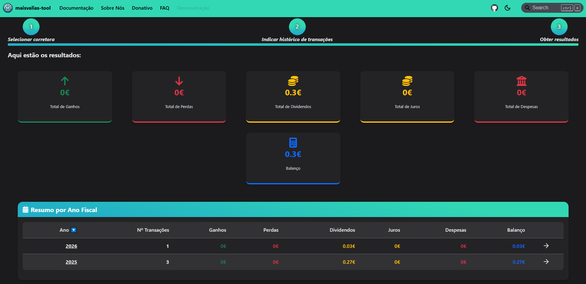

# Trade Republic

Descobre como utilizar a ferramenta com esta corretora.

Para utilizares a ferramenta `maisvalias-tool` com esta corretora, precisas de obter o histórico das transações efetuadas **desde do ano em que realizaste a primeira compra de um ativo**.

De seguida é apresentado uma tabela com os eventos tributáveis que a ferramenta consegue processar:

| Evento tributável | Suportado | Nota |
|:-----------------|:----------:|:-----|
|       Ganhos de capital         |     🟢       |       |
|        Dividendos               |     🟢       |       |
|        Juros                    |     🟡       |   Implementado mas ainda não foi possível testar    |

O seguinte guia vai ensinar-te, passo a passo, como calcular automaticamente as tuas mais valias obtidas através da Trade Republic.

## Como obter ficheiro do histórico de transações

### Passo 1: Aceder ao menu

### Passo 2: Consultar extratos

### Passo 3: Selecionar extrato da conta

### Passo 4: Selecionar intervalo de datas para o histórico de transações

:::info

Preenche o intervalo máximo de datas de modo obtenhas os dados desde que criaste conta na Trade Republic. Será preciso todas as transações para que a fórmula de cálculo (FIFO) funcione corretamente.

:::

### Passo 5: Exportar extrato

:::info

Confirma se as datas do extrato correspondem às do intervalo que colocaste. Por vezes a aplicação da Trade Republic pode não captar corretamente as datas que selecionaste.

:::

Agora que tens todos os ficheiros necessários, vamos ver como utilizá-los no `maisvalias-tool`.

## Como utilizar maisvalias-tool

No site oficial, navega até à página `Demonstração`:

De seguida, seleciona a `Trade Republic`:

Nos ficheiros, coloca **todos os ficheiros que exportaste na [fase anterior](#como-obter-ficheiro-do-histórico-de-transações)**:

___

:::info

Os nomes dos ficheiros exportados foram alterados para serem mais fáceis de identificar.

De qualquer modo o nome dos ficheiros não é relevante, mas sim o seu conteúdo!

:::

Com os ficheiros carregados, basta dares início ao processo de cálculo:

___

:::success

_Et voilá_! Deverás ter discriminado por ano fiscal tanto as mais valias como os dividendos que tens de declarar no IRS.

:::