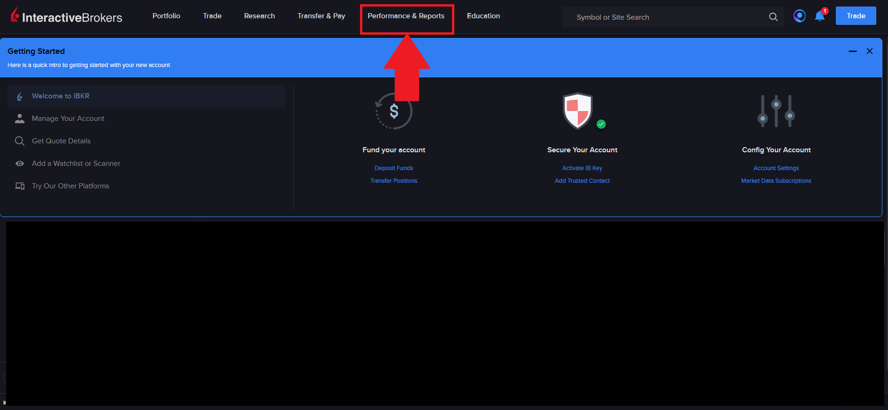
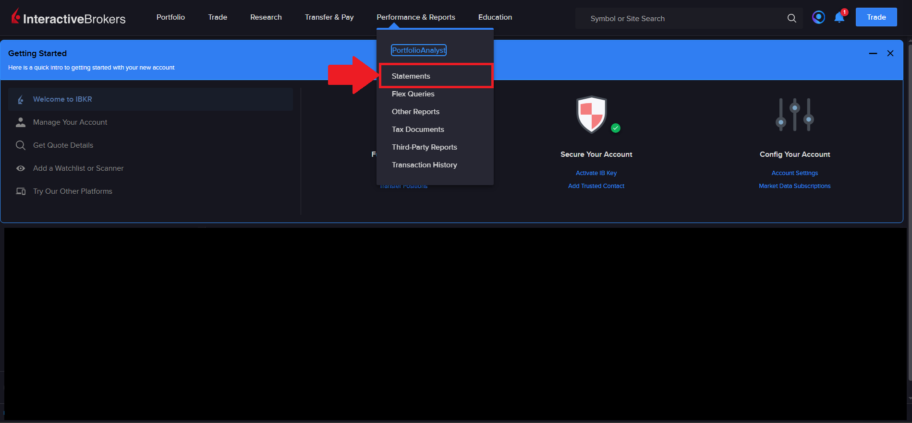
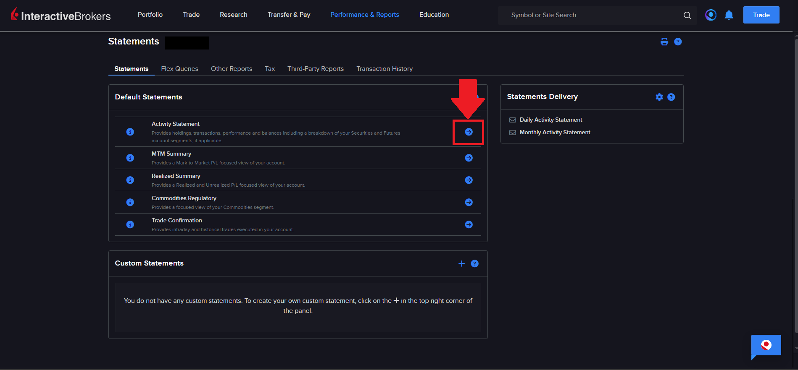
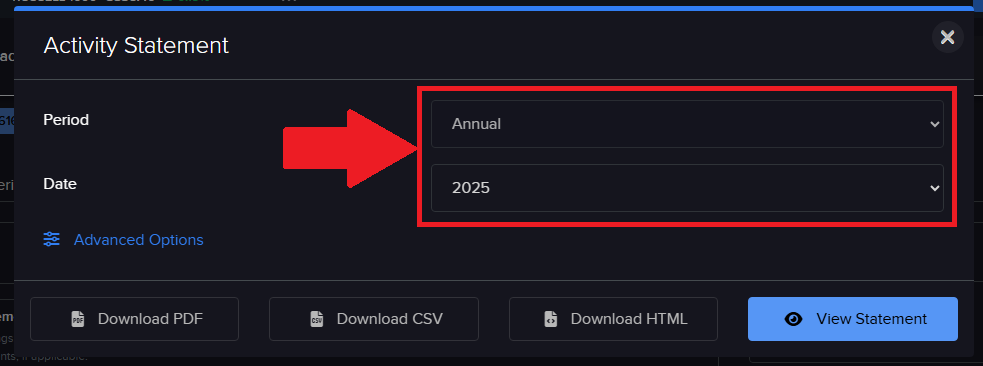
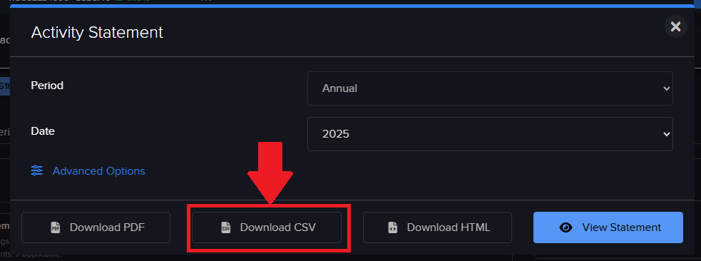
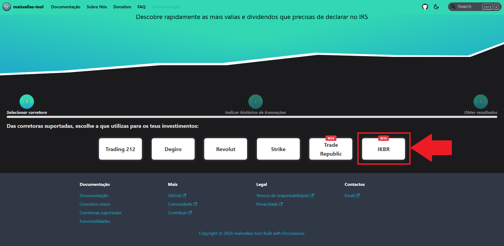
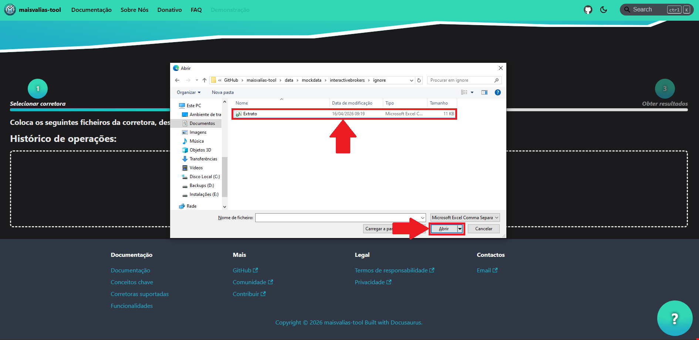
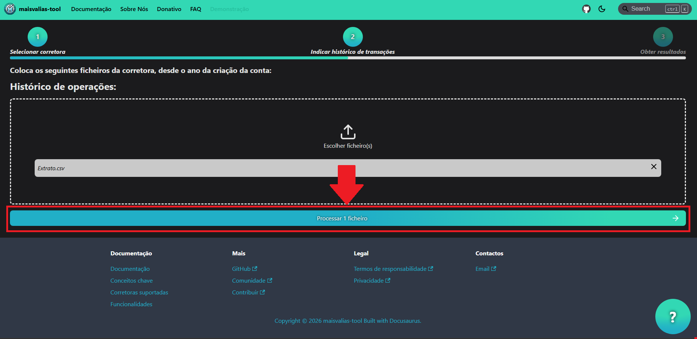
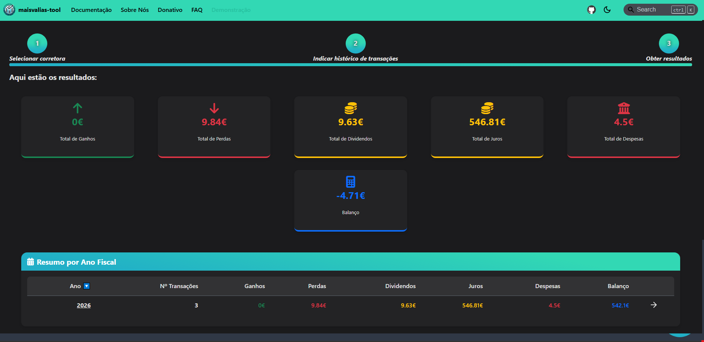

# InteractiveBrokers

Descobre como utilizar a ferramenta com esta corretora.

Para utilizares a ferramenta `maisvalias-tool` com esta corretora, precisas de obter o histórico das transações efetuadas **desde do ano em que realizaste a primeira compra de um ativo**.

De seguida é apresentado uma tabela com os eventos tributáveis que a ferramenta consegue processar:

| Evento tributável | Suportado | Nota |
|:-----------------|:----------:|:-----|
|       Ganhos de capital         |     🟡       |   Funciona, mas pelo facto do extrato não apresentar o ISIN da ação, a ferramenta não consegue extrair o país de origem do ativo (importante no preenchimento dos anexos do IRS)    |
|        Dividendos               |     🟡       |    Funciona, mas não apresenta eventuais impostos retidos no país de origem   |
|        Juros                    |     🟢      |       |

O seguinte guia vai ensinar-te, passo a passo, como calcular automaticamente as tuas mais valias obtidas através da InteractiveBrokers.

## Como obter ficheiro do histórico de transações

### Passo 1: Aceder ao menu _Performance & Reports_

### Passo 2: Consultar extratos (_Statements_)

### Passo 3: Selecionar _Activity Statement_

### Passo 4: Exportar o extrato das transações

### Passo 5: Repetir passos anteriores, para cada ano

Repete os passos anteriores para cada ano em que tens conta na InteractiveBrokers.

Se, por exemplo, tiveres criado conta em 2022, exporta o histórico de 2022, 2023, 2024, ..., até ao ano atual.

Agora que tens todos os ficheiros necessários, vamos ver como utilizá-los no maisvalias-tool.

## Como utilizar maisvalias-tool

No site oficial, navega até à página `Demonstração`:

De seguida, seleciona a `IKBR`:

Nos ficheiros, coloca **todos os ficheiros que exportaste na [fase anterior](#como-obter-ficheiro-do-histórico-de-transações)**:

___

:::info

Os nomes dos ficheiros exportados foram alterados para serem mais fáceis de identificar.

De qualquer modo o nome dos ficheiros não é relevante, mas sim o seu conteúdo!

:::

Com os ficheiros carregados, basta dares início ao processo de cálculo:

___

:::success

_Et voilá_! Deverás ter discriminado por ano fiscal tanto as mais valias como os dividendos que tens de declarar no IRS.

:::