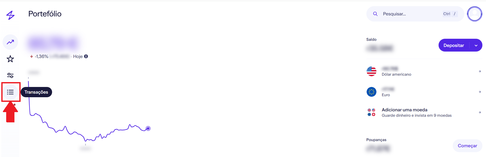
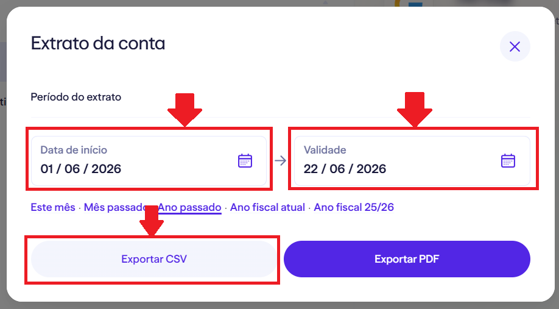
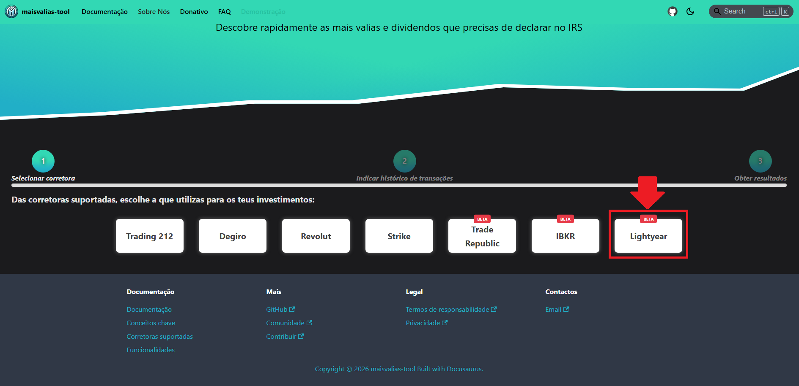
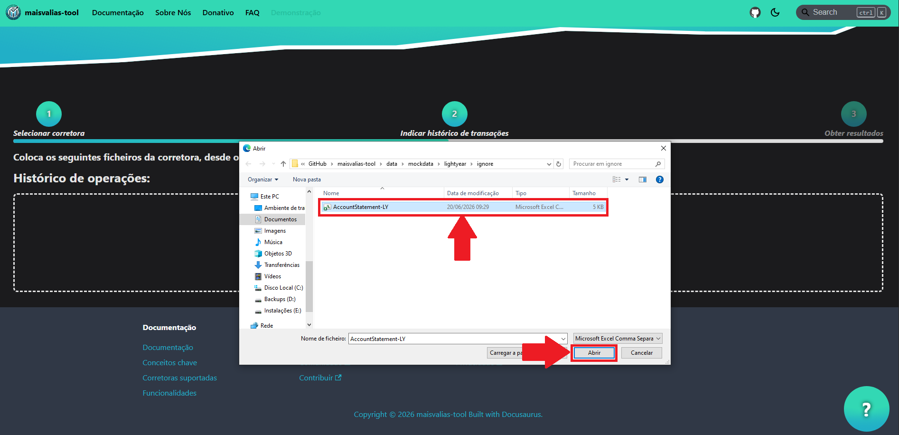
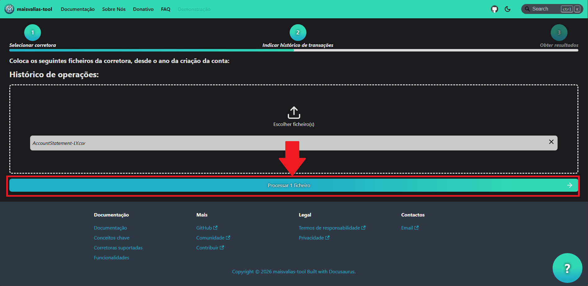
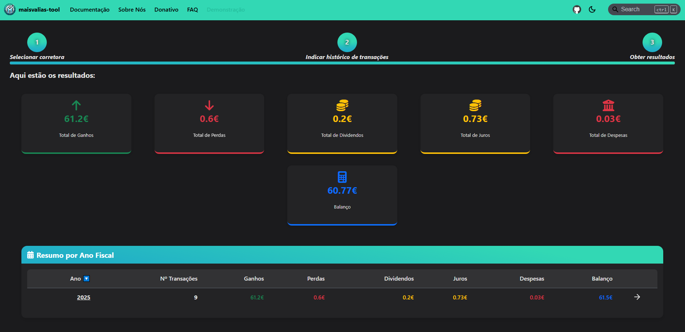

# Lightyear

Descobre como utilizar a ferramenta com esta corretora.

Para utilizares a ferramenta `maisvalias-tool` com esta corretora, precisas de obter o histórico das transações efetuadas **desde do ano em que realizaste a primeira compra de um ativo**.

De seguida é apresentado uma tabela com os eventos tributáveis que a ferramenta consegue processar:

| Evento tributável | Suportado | Nota |
|:-----------------|:----------:|:-----|
|       Ganhos de capital         |     🟢       |       |
|        Dividendos               |     🟢       |       |
|        Juros                    |     🟢       |       |

O seguinte guia vai ensinar-te, passo a passo, como calcular automaticamente as tuas mais valias obtidas através da Lightyear.

## Como obter ficheiro do histórico de transações

### Passo 1: Aceder ao menu _Transações_

### Passo 2: Selecionar _Extrato da conta_

### Passo 3: Exportar em formato CSV

### Passo 4: Repetir passos anteriores, para cada ano

Repete os passos anteriores para cada ano em que tens conta na Lightyear.

Se, por exemplo, tiveres criado conta em 2022, exporta o histórico de 2022, 2023, 2024, ..., até ao ano atual.

Agora que tens todos os ficheiros necessários, vamos ver como utilizá-los no maisvalias-tool.

## Como utilizar maisvalias-tool

No site oficial, navega até à página `Demonstração`:

De seguida, seleciona a `Lightyear`:

Nos ficheiros, coloca **todos os ficheiros que exportaste na [fase anterior](#como-obter-ficheiro-do-histórico-de-transações)**:

___

Com os ficheiros carregados, basta dares início ao processo de cálculo:

___

:::success

_Et voilá_! Deverás ter discriminado por ano fiscal tanto as mais valias como os dividendos que tens de declarar no IRS.

:::