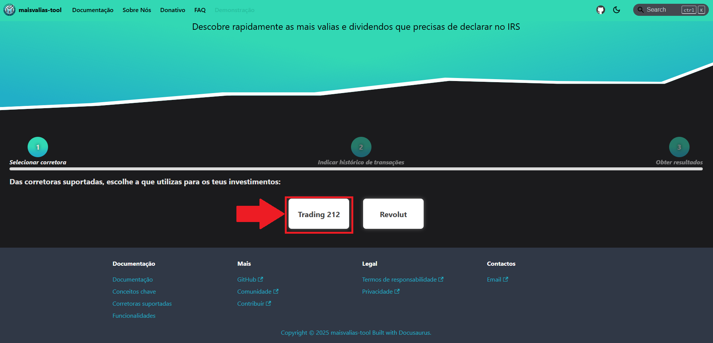
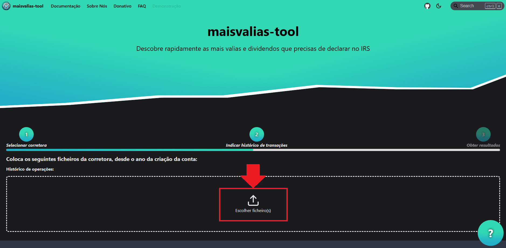
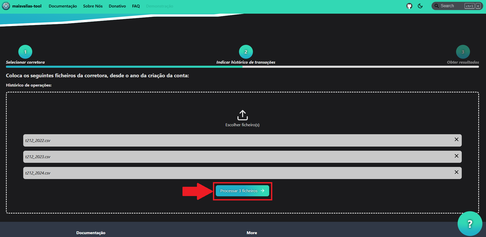
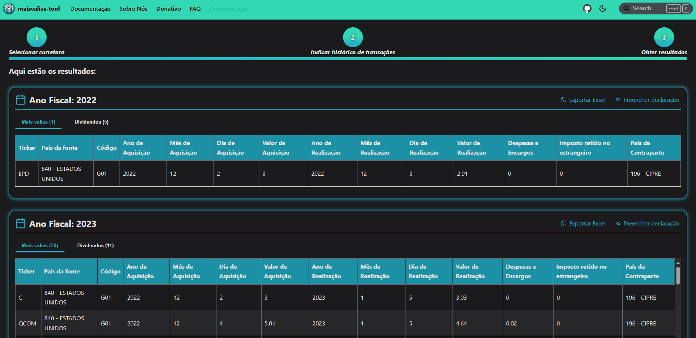

# Calcular mais-valias e dividendos

Calcula e organiza os resultados para declarar no IRS.

**O principal motivo para estares aqui: queres saber o que precisas de declarar no IRS!**  
Segue os seguintes passos para obteres a resposta:

#### _1. No site oficial, dirige-te à página de demonstração:_

#### _2. Escolhe a tua corretora:_

#### _3. Coloca os ficheiros necessários:_

:::info

Para saberes quais ficheiros são necessários para a tua corretora, consulta as [corretoras suportadas](/docs/category/corretoras-suportadas).

:::

#### _4. Iniciar o cálculo das mais-valias:_

Depois é só esperar alguns segundos...

_Et voilá_! Tens as mais-valias e dividendos que deves declarar no IRS, organizado por ano fiscal.

De seguida descobre como podes exportar os resultados obtidos para um excel, para os analisares com tempo.