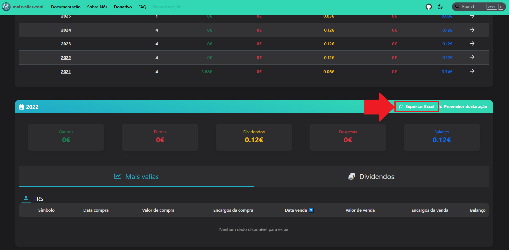

# Exportar - Excel

Guarda os resultados num Excel para posterior validação.

Na verdade é bastante simples, se já tiveres obtido os resultados da ferramenta. Caso contrário, vê [Calcular mais-valias e dividendos](/docs/como-utilizar/calcular-mais-valias).

Para exportares, carrega no botão `Exportar Excel` no painel do ano fiscal que pretenderes:

Irás fazer download de um ficheiro em excel com duas _spreadsheets_: uma para mais-valias e outra para dividendos:

Se estiveres à vontade com os resultados que a ferramenta calculou, podes ir mais à frente e preencher automaticamente a tua declaração de IRS com o próximo guia.