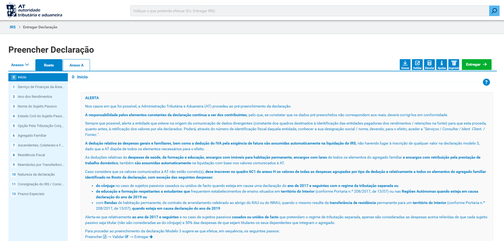
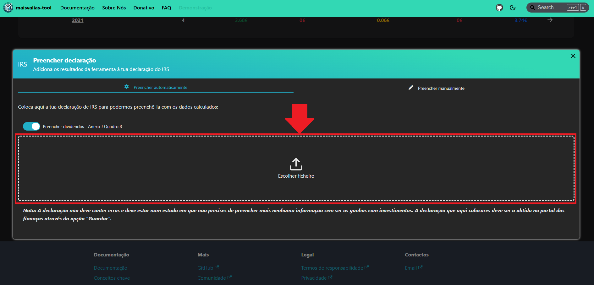

# Exportar - Declaração IRS

Coloca os resultados automaticamente na tua declaração de IRS.

Se já tiveres retificado os resultados da ferramenta através do [guia anterior](./01-exportar-excel.md), então poderás exportar os resultados para uma declaração de IRS.

Segue os seguintes passos:

### _1. Fazer download da declaração de IRS_

Para obteres o ficheiro da tua declaração de IRS, consulta o [portal das finanças](https://www.portaldasfinancas.gov.pt/at/html/index.html).

Lá entra na tua declaração de IRS:

Agora preenche toda a informação que normalmente terias de preencher, à exceção da componente dos investimentos no estrangeiro.
Valida a declaração:

Agora acrescenta à declaração o **anexo J**:

Preenche o teu número de contribuinte (NIF):

Por fim, grava a declaração no teu dispositivo:

No final destes passos deves ter contigo um ficheiro `.xml` correspondente à tua declaração.

Agora vamos preencher o **anexo J** através da **maisvalias-tool**.

### _2. Preencher automaticamente a declaração de IRS_

Se já tiveres completado a [etapa anterior](#1-fazer-download-da-declaração-de-irs), falta agora preencher a declaração com os resultados obtidos pela **maisvalias-tool**.

Se ainda não tiveres obtido os resultados do processamento dos teus investimentos por parte da ferramenta, vê [Calcular mais-valias e dividendos](/docs/como-utilizar/calcular-mais-valias).

Dependendo do ano fiscal ao qual tens de declarar os rendimentos, escolhe a opção _Preencher declaração_:

:::info

Neste exemplo considerou-se que estou a preencher uma declaração correspondente ao ano fiscal **2022**.

No teu caso, à partida, será relativo ao **ano anterior** _(ex.: Se estás em 2025 vais querer os resultados do ano fiscal 2024)_.

:::

Agora adiciona a declaração de IRS:

E por fim basta iniciar o processo de preenchimento da declaração:

:::info

O nome _"decl-2022.xml"_ não é o nome original fornecido pela _AT_, tendo sido alterado para ser mais fácil de identificar.

De qualquer modo o nome do ficheiro não é relevante, mas sim o seu conteúdo!

:::

Agora terás a tua declaração de IRS já preenchida com os resultados das mais-valias e dividendos.

### _3. Carregar nova declaração pré-preenchida no Portal das Finanças_
O último passo que falta, se assim o pretenderes, é carregares esta nova declaração no portal das finanças.   
Quando fores à opção, do portal das finanças, para entregar a declaração, escolhe a opção que te permite carregar um ficheiro:

Escolhe a declaração preenchida pela **maisvalias-tool**:

E se tudo correr bem, irá aparecer a seguinte notificação:

Para verificar se a importação correu bem, recomendamos que consultes o **anexo J**:

_Dividendos:_

_Mais-valias:_

:::warning

Lembra-te de fazeres a tua própria retificação dos resultados! Os dados fornecidos pela **maisvalias-tool** **não são vinculativos e servem apenas de apoio ao investidor**, pelo que existe a necessidade de confirmar os resultados junto de uma entidade profissional e competente. Não nos responsabilizamos caso a ferramenta prejudique o utilizador.

:::
